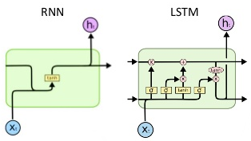

# RNN-LSTM-No-Libraries-
RNN and LSTM from Scratch only using Numpy.

RNN-LSTM networks can be applied to almost any kind of sequential data. One of the most popular use case is natural language processing, which I will include in this project only using numpy and no libraries.
The RNN-LSTM cell memorizes the data that is relevant and forgets any long-term information that is no longer needed whenever a new input arrives. 

